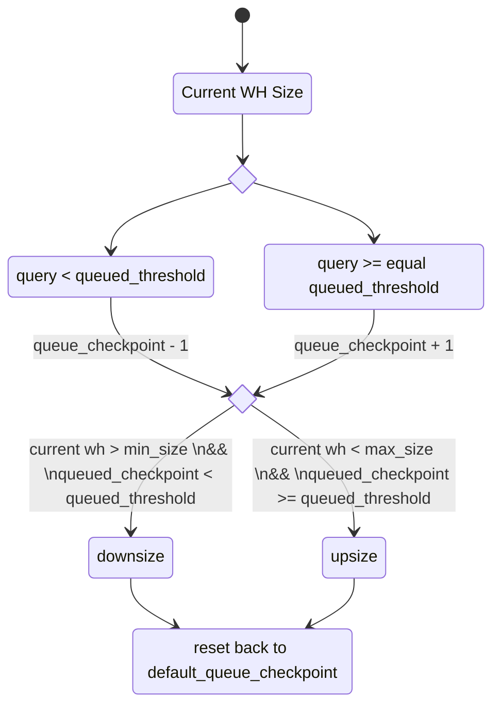
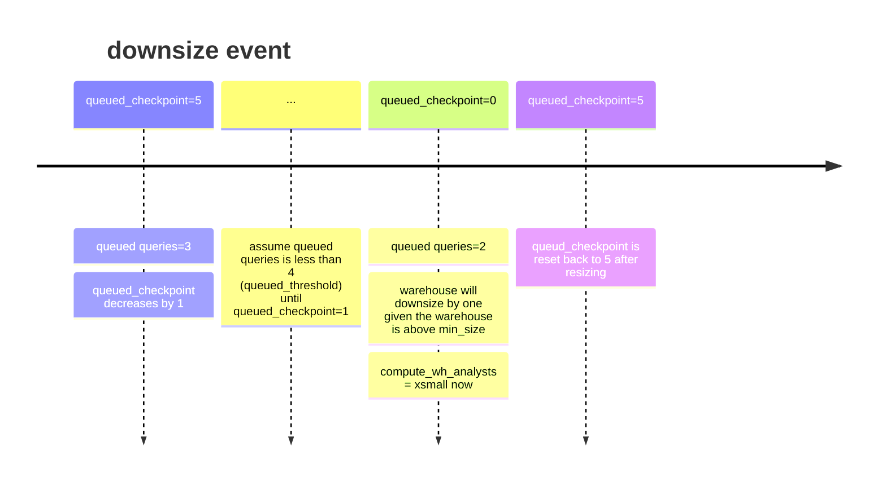

# High Level


# Example
Let's assume queue threshold is at 4, meaning when the warehouse autoscaler detects there are 4 queries queued, queued_checkpoint will increase by 1, vice versa. The following are the assumed configuration:

```yaml
username: jdoe@email.com
account: hello.us-east-1
role: wh_admin
warehouse_usage: compute_wh_admin
warehouse_autoscale: compute_wh_analysts
min_size: xsmall
max_size: xxlarge
current_size: xsmall
queued_threshold: 4
default_queue_checkpoint: 5
```


So after upsizing, the warehouse manage to start clearing the queued queries and now the queue has been reduced.




# Disclaimer
As of current design, the upsize interval is hardcoded at 10 mins and downsize interval is hardcoded at 5 mins.